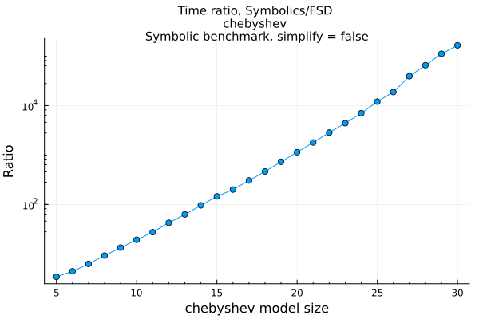
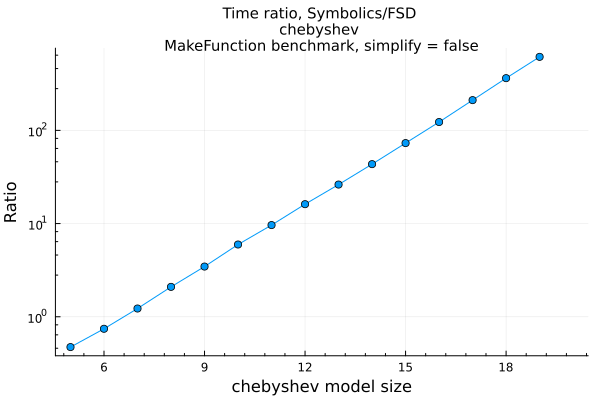

#  Symbolic Processing

Because **FD** can generate true symbolic derivatives it can easily be used in conjunction with Symbolics.jl.

A rule of thumb is that if your function is small (a few hundred operations or less) or tree like (where each node in the expression graph has one parent on average) then Symbolics.jl may outperform or equal **FD**. For more complex functions with many common subexpressions **FD** may substantially outperform Symbolics.jl.
 
These benchmarks should give you a sense of what performance you might achieve for symbolic processing. There are three types of benchmarks: **Symbolic**, **MakeFunction**, and **Exe**.

* The **Symbolic** benchmark is the time required to compute just the symbolic form of the derivative. The Symbolic benchmark can be run with simplification turned on or off for Symbolics.jl. If simplification is on then computation time can be extremely long but the resulting expression might be simpler and faster to execute.

* The **MakeFunction** benchmark is the time to generate a Julia Expr from an already computed symbolic derivative and to then compile it.

* The **Exe** benchmark measures just the time required to execute the compiled function using an in-place matrix.

All benchmarks show the ratio of time taken by Symbolics.jl to FastDifferentiation.jl. Numbers greater than 1 mean FastDifferentiation is faster.

All benchmarks were run on an AMD Ryzen 9 7950X 16-Core Processor with 32GB RAM running Windows 11 OS, Julia version 1.9.0.
### Chebyshev polynomial
The first example is a recursive function for 
the Chebyshev polynomial of order n:

```
@memoize function Chebyshev(n, x)
    if n == 0
        return 1
    elseif n == 1
        return x
    else
        return 2 * (x) * Chebyshev(n - 1, x) - Chebyshev(n - 2, x)
    end
end
```
The function is memoized so the recursion executes efficiently. 

The recursive function returns an nth order polynomial in the variable x. The derivative of this polynomial would be order n-1 so a perfect symbolic simplification would result in a function with 2*(n-2) operations. For small values of n Symbolics.jl simplification does fairly well but larger values result in very inefficient expressions.

Because **FD** doesn't do sophisticated symbolic simplification it generates a derivative with approximately 2.4x the number of operations in the original recursive expression regardless of n. This is a case where a good hand generated derivative would be more efficient than **FD**.

The Chebyshev expression graph does not have many nodes even at the largest size tested (graph size increases linearly with Chebyshev order).

The first set of three benchmarks show results with simplification turned off in Symbolics.jl, followed by a set of three with simplification turned on. Performance is somewhat better in the latter case but still slower than the FD executable. Note that the y axis is logarithmic.

#### Chebyshev benchmarks with simplification off
 
 


#### Chebyshev benchmarks with simplification on


With simplification on performance of the executable derivative function for Symbolics.jl is slightly better than with simplification off. But simplification processing time is longer.
 
### Spherical Harmonics

The second example is the spherical harmonics function. This is the expression graph for the spherical harmonic function of order 8:


<details>
    <summary> Source for spherical harmonics benchmark </summary>

```
@memoize function P(l, m, z)
    if l == 0 && m == 0
        return 1.0
    elseif l == m
        return (1 - 2m) * P(m - 1, m - 1, z)